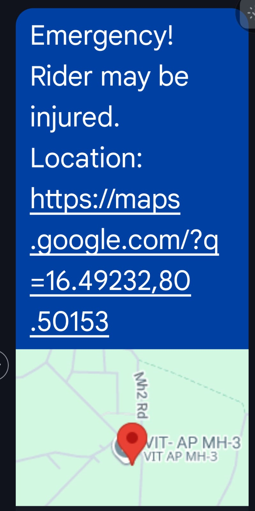

# Crash Detection System

## Overview
An IoT-based crash detection and emergency response system that integrates embedded hardware, wireless communication, and backend services to detect accidents and send real-time alerts.

## Features
- Real-time crash detection using ESP32 and MPU6050 sensor  
- Emergency alert system with location sharing  
- Mobile app interface for monitoring and interaction  
- Backend processing for handling crash events and notifications  

## Tech Stack
- **chatbot Backend:** Python, FastAPI  
- **IoT Hardware:** ESP32, MPU6050  
- **Communication:** Bluetooth Classic, HTTP APIs  
- **Mobile App:** MIT App Inventor (Kotlin for future improvement) 
- **Concepts:** Real-time data processing, sensor integration, IoT system design  

## Project Structure
- `chatbot_backend/` → Backend service (originally deployed on Replit)  
- `app/` → Mobile app (.aia file from MIT App Inventor)  
- `esp32_code/` → Microcontroller code for crash detection  
- `docs/` → Documentation and system visuals  

## App UI

## App UI

  
  
  

  

## System Architecture
The system uses an ESP32 with motion sensors to continuously monitor movement. Upon detecting abnormal motion patterns, the device communicates with a backend server via Bluetooth Classic or network APIs. The backend processes the data and triggers emergency alerts, including location sharing through the mobile application.

## How It Works
1. MPU6050 sensor detects sudden motion or impact  
2. ESP32 processes sensor data and identifies potential crashes  
3. Data is transmitted to the backend system  
4. Backend triggers alerts and shares location with emergency contacts  
5. Mobile app provides interface for monitoring and response  

## Future Improvements
- ML-based crash prediction and severity analysis  
- BLE-based communication optimization  
- Native Android app development using Kotlin for improved performance and UI  
